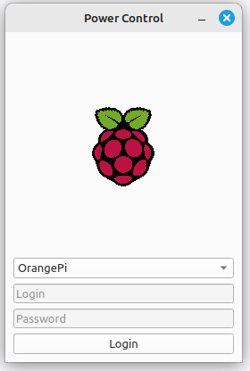
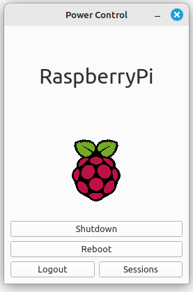
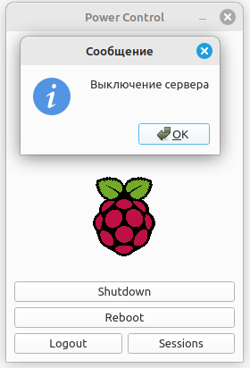
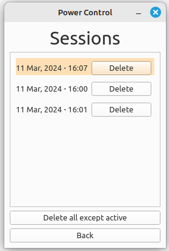

Template Qt6 app for api
----

This application can shutdown or reboot servers. To to add servers need add new record to ```config.json```. Server images are stored in ```img/*```.

### Screenshots






## Start

    python -m venv .venv
    source .venv/bin/activate
    pip install -r requirements.txt
    python -m database.model # create encrypted sqlite db
    python -m main.py

In ```database.model``` you can set database file name and password as following:

    db_name = "power.db"
    password = "pwd9889" # Change me!!!

## Project:

- busness_logic
    - api
        - requests - dedicated classes only for API requests
        - base_requests.py - the class is responsible for connecting/ reconnecting and sending requests to the api
        - qt_login_controller.py - sending requests to the api, store tokens in database, logout user from app
    - general_storage.py - a shared object that is available on all pages. It contains the necessary classes
    - singleton.py - design pattern
- database - classes interacting with database
- pages - storing application pages that are inherited from IPage.py
    - markup (function) - graphic elements are created in it and added to the main layout
    - message.py - error notifications
- BaseWidgets.py - in this file have been added repeating widgets
- Navigator.py - an object that controls page navigation
    - add_page_to_queue - this method allow navigate to page in ```markup``` section (call stack: 
    
            # 1
            def markup(): # in login page
                if ...:
                    navigator.navigate(IPage())
                ...


            1 navigate to login page
            2    try to navigate to IPage
            3    create markup to IPage
            4 set markup login page as main # navigate to login page complete

            # 2
            def markup(): # in login page
                if ...:
                    navigator.add_page_to_queue(IPage())
                ...


            1 navigate to login page
            2    add IPage to queue
            3 set markup login page as main # navigate to login page complete
            4 navigator check queue and navigate to IPage # navigate to IPage complete
    
    )


#### Fix error

    sudo apt install xcb libxcb-cursor0
    # sudo apt install libsqlcipher-dev # pip install pysqlcipher3
    pip install sqlcipher3-binary
